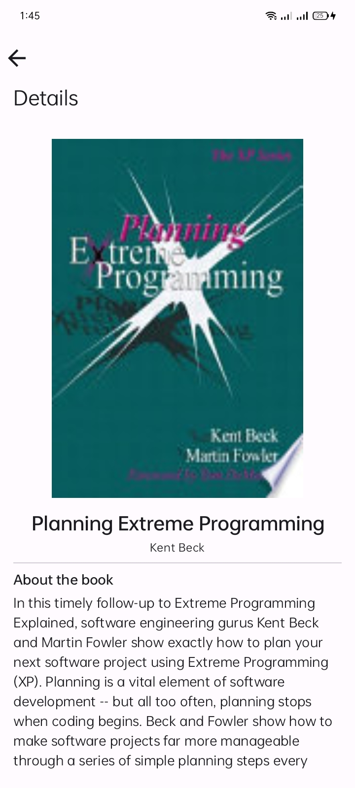

# 📚 Bookshelf App

Bookshelf is an Android app from the **Android Basics with Compose** project. It allows users to search for books and fetches book volumes from the **Google Books API**. Users can also save their favorite books for easy access later.


## ✨ Features

- 🔍 **Search for Books:** Use the Google Books API to search for books by title or author.
- 📚 **Browse Categories:** Explore books by categories for easy browsing.
- 📖 **Detailed Book Information:** View details such as book cover, author, and description.
- ❤️ **Favorites:** Add books to your favorites list for quick access later.

## 🛠️ Technologies Used

- **Google Books API:** Fetches book volumes from Google’s Books API.
- **Retrofit:** REST API integration to handle network requests and responses.
- **GSON Converter:** Converts JSON data from API responses into Kotlin objects.
- **Dependency Injection:** Manual dependency injection provides repositories to `ViewModel`s.
- **Kotlin Coroutines:** Handles background tasks asynchronously, improving UI responsiveness.
- **Coil:** A lightweight image loading library for loading and caching book covers.
- **Room:** A local database for storing users' favorite books.
- **Kotlin Flows:** Reactively updates favorite books in real-time using Flow.
- **Jetpack Compose:** Modern toolkit for building native Android UIs.

## 🖼️ Screenshots

### Home Screen
Displays the user's favorite books and recommended books.


### Query Screen
Displays search results based on the user's input.


### Favorites Screen
Shows all the user's favorite books in a grid layout.


### Book Details
Provides detailed information about a selected book, including its description, author, and publication details.


## 🚀 Installation

To install and run the app:

1. Clone this repository:
   ```bash
   git clone https://github.com/yourusername/bookshelf-app.git
